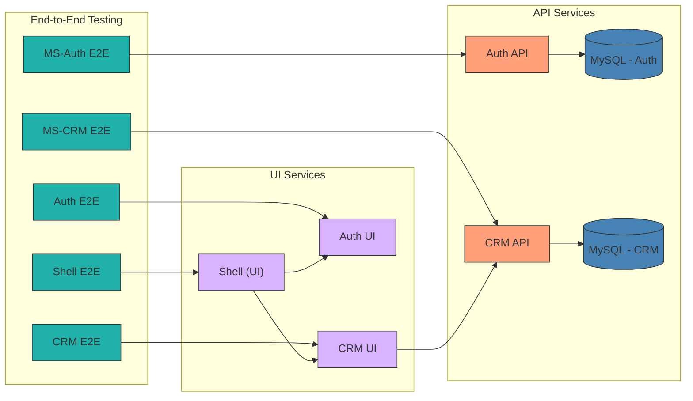

# NestLance – AI-Powered Freelancer CRM & Automation

This repository is a **showcase project** for my **portfolio and CV**, demonstrating expertise in **full-stack development** using **Nx, NestJS, Swagger, and Angular**.
It is designed to manage **freelancers & consultants** by automating client interactions, invoicing, and project management with AI-powered features.

## 🚀 Purpose
This project is built for **learning and demonstration purposes**, showcasing:

✅ **Microservices Architecture** – Scalable backend with **NestJS & Fastify**  
✅ **AI-Powered Proposal Generator** – Automates client proposals using **OpenAI**  
✅ **Smart Invoicing & Payments** – **Stripe & PayPal integration** for automated billing  
✅ **Task & Project Management** – **Kanban board, deadlines, milestones**  
✅ **Time Tracking & Expense Management** – Logs billable hours & financial insights  
✅ **Event-Driven System** – Uses **RabbitMQ** for async microservice communication  
✅ **Containerized Deployment** – **Docker & Kubernetes** integration  
✅ **Dynamic Module Federation** – **Nx workspace optimization** for microfrontends  
✅ **Environment Management** – Secure **env validation & configuration**

This project serves as a **technical showcase** to highlight **full-stack development, DevOps, and AI automation skills** perfect for my **CV & portfolio**. 🚀🔥

Check out the source code and **see how its built!** 💼💡

## User story

## Architecture
    

