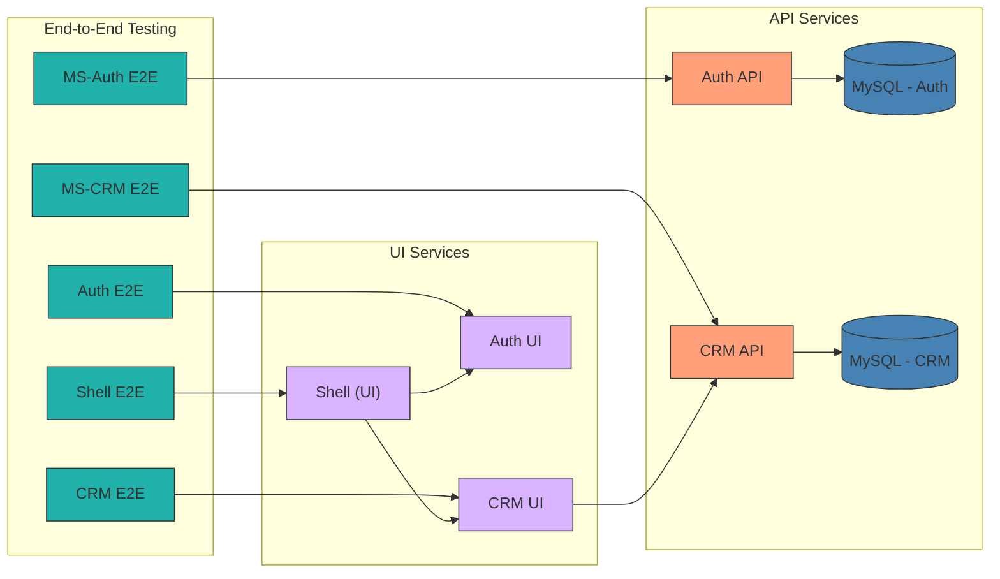

# NestLance – AI-Powered Freelancer CRM & Automation

This repository is a **showcase project** for my **portfolio and CV**, demonstrating expertise in **full-stack development** using **Nx, NestJS, Swagger, and Angular**.
It is designed to manage **freelancers & consultants** by automating client interactions, invoicing, and project management with AI-powered features.

coming soon... 

## User story
...

## Architecture
    

